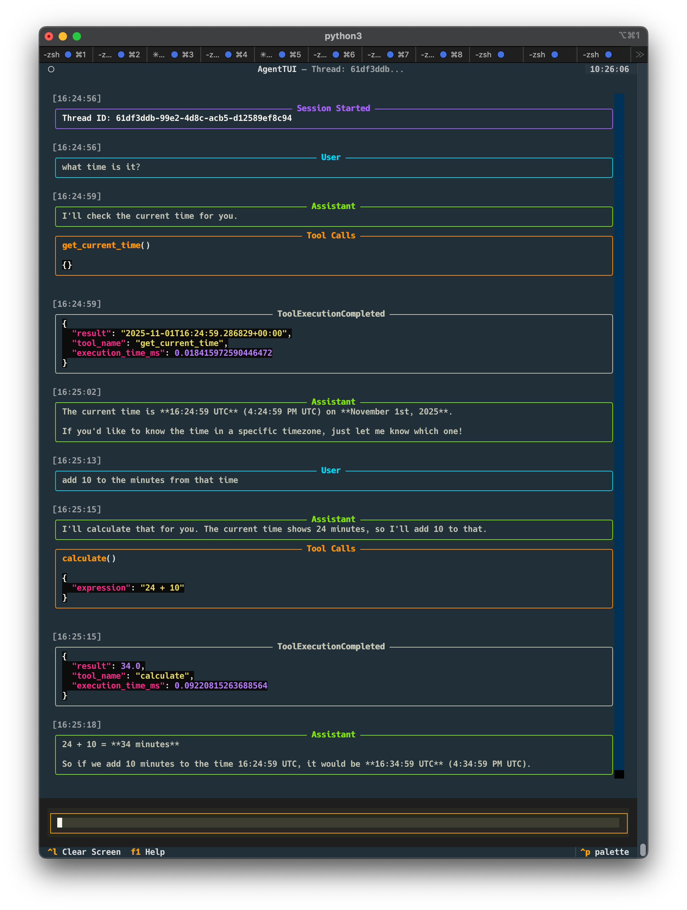

# messagedb-agent

Event-sourced agent system using Message DB for durable, observable, and distributed execution.

Inspired by [Geoffrey Huntley's how to build a coding agent](https://ghuntley.com/agent/). What happens when the agent event-sources its message/session history instead of keeping it in an in-memory array?

## Spec-Driven Development

First I wrote [notes.md](/notes.md) by hand.

Then I used Claude Code (CC) to translate notes.md into [spec.md](/spec.md).

Then I had CC extract [implementation-decisions.md](/implementation-decisions.md) from spec.md.

Then I wrote [basic-python.md](/basic-python.md) by hand.

Then I had CC use spec.md, implementation-decisions.md, and basic-python.md to create [tasks.md](/tasks.md).

Then I had CC implement each task by starting a new session and prompting something like:

```
read @spec.md and @tasks.md and complete Task 2.3
```

Now trying out [beads](https://github.com/steveyegge/beads)...

### Best Practices

- git commit everything from the beginning
- /export every claude code session at the end

## Overview

This project implements an event-sourced architecture for agent systems where all agent interactions, decisions, and actions are recorded as immutable events in persistent streams. The system enables durable, observable, and distributed execution of agent workflows through event-driven processing.

## Web Example

A browser chat client that streams agent responses and uses an LLM-generated html display of the agent's events. Looks different every time!

```
docker compose up -d
uv run messagedb-agent-api
```


## TUI Example

```
docker compose up -d
./tui
```



Events in Message DB:

```
PGPASSWORD=message_store_password PGOPTIONS="--search_path=message_store" psql -h localhost -p 5433 -U postgres -d message_store

message_store=# select position,time,type,data,metadata from messages where stream_name='agent:v0-c9fcdc1c-a3a3-46e0-be9f-72707ea59d2c' order by global_position asc;
-[ RECORD 1 ]-------------------------------------------------------------------------------------------------------------------------------------------------------------------------------------------------------------------------------------------------------------------------------------------------------------------------------------------------------------------------------------------------
position | 0
time     | 2025-10-30 14:55:20.794384
type     | SessionStarted
data     | {"thread_id": "c9fcdc1c-a3a3-46e0-be9f-72707ea59d2c"}
metadata | {}
-[ RECORD 2 ]-------------------------------------------------------------------------------------------------------------------------------------------------------------------------------------------------------------------------------------------------------------------------------------------------------------------------------------------------------------------------------------------------
position | 1
time     | 2025-10-30 14:55:20.807923
type     | UserMessageAdded
data     | {"message": "what is the current time?", "timestamp": "2025-10-30T14:55:20.807559+00:00"}
metadata | {}
-[ RECORD 3 ]-------------------------------------------------------------------------------------------------------------------------------------------------------------------------------------------------------------------------------------------------------------------------------------------------------------------------------------------------------------------------------------------------
position | 2
time     | 2025-10-30 14:55:24.737806
type     | LLMResponseReceived
data     | {"model_name": "claude-sonnet-4-5@20250929", "tool_calls": [{"id": "toolu_vrtx_01XKyBCZDUnUQ9zyGhZ3VBuN", "name": "get_current_time", "arguments": {}}], "token_usage": {"input_tokens": 924, "total_tokens": 972, "output_tokens": 48}, "response_text": "I'll retrieve the current time for you."}
metadata | {"retry_count": 0}
-[ RECORD 4 ]-------------------------------------------------------------------------------------------------------------------------------------------------------------------------------------------------------------------------------------------------------------------------------------------------------------------------------------------------------------------------------------------------
position | 3
time     | 2025-10-30 14:55:24.760763
type     | ToolExecutionRequested
data     | {"arguments": {}, "tool_name": "get_current_time"}
metadata | {"tool_id": "toolu_vrtx_01XKyBCZDUnUQ9zyGhZ3VBuN", "tool_index": 0, "tool_call_id": "toolu_vrtx_01XKyBCZDUnUQ9zyGhZ3VBuN"}
-[ RECORD 5 ]-------------------------------------------------------------------------------------------------------------------------------------------------------------------------------------------------------------------------------------------------------------------------------------------------------------------------------------------------------------------------------------------------
position | 4
time     | 2025-10-30 14:55:24.776808
type     | ToolExecutionCompleted
data     | {"result": "2025-10-30T14:55:24.774177+00:00", "tool_name": "get_current_time", "execution_time_ms": 0.015500001609325409}
metadata | {"tool_id": "toolu_vrtx_01XKyBCZDUnUQ9zyGhZ3VBuN", "tool_index": 0, "tool_call_id": "toolu_vrtx_01XKyBCZDUnUQ9zyGhZ3VBuN"}
-[ RECORD 6 ]-------------------------------------------------------------------------------------------------------------------------------------------------------------------------------------------------------------------------------------------------------------------------------------------------------------------------------------------------------------------------------------------------
position | 5
time     | 2025-10-30 14:55:26.864578
type     | LLMResponseReceived
data     | {"model_name": "claude-sonnet-4-5@20250929", "tool_calls": [], "token_usage": {"input_tokens": 1003, "total_tokens": 1073, "output_tokens": 70}, "response_text": "The current time is **14:55:24 UTC** (2:55:24 PM UTC) on **October 30, 2025**.\n\nThis is in Coordinated Universal Time (UTC). If you'd like to know the time in a specific timezone, I can retrieve that for you as well."}
metadata | {"retry_count": 0}
-[ RECORD 7 ]-------------------------------------------------------------------------------------------------------------------------------------------------------------------------------------------------------------------------------------------------------------------------------------------------------------------------------------------------------------------------------------------------
position | 6
time     | 2025-10-30 14:56:23.478131
type     | UserMessageAdded
data     | {"message": "add 10 to the minutes from that current time", "timestamp": "2025-10-30T14:56:23.477056+00:00"}
metadata | {}
-[ RECORD 8 ]-------------------------------------------------------------------------------------------------------------------------------------------------------------------------------------------------------------------------------------------------------------------------------------------------------------------------------------------------------------------------------------------------
position | 7
time     | 2025-10-30 14:56:25.624729
type     | LLMResponseReceived
data     | {"model_name": "claude-sonnet-4-5@20250929", "tool_calls": [{"id": "toolu_vrtx_01Ke87h3stLcJcCvGaK2nFxC", "name": "calculate", "arguments": {"expression": "55 + 10"}}], "token_usage": {"input_tokens": 1087, "total_tokens": 1165, "output_tokens": 78}, "response_text": "I'll calculate the time with 10 minutes added to the current minutes (55 + 10)."}
metadata | {"retry_count": 0}
-[ RECORD 9 ]-------------------------------------------------------------------------------------------------------------------------------------------------------------------------------------------------------------------------------------------------------------------------------------------------------------------------------------------------------------------------------------------------
position | 8
time     | 2025-10-30 14:56:25.632206
type     | ToolExecutionRequested
data     | {"arguments": {"expression": "55 + 10"}, "tool_name": "calculate"}
metadata | {"tool_id": "toolu_vrtx_01Ke87h3stLcJcCvGaK2nFxC", "tool_index": 0, "tool_call_id": "toolu_vrtx_01Ke87h3stLcJcCvGaK2nFxC"}
-[ RECORD 10 ]------------------------------------------------------------------------------------------------------------------------------------------------------------------------------------------------------------------------------------------------------------------------------------------------------------------------------------------------------------------------------------------------
position | 9
time     | 2025-10-30 14:56:25.642733
type     | ToolExecutionCompleted
data     | {"result": 65.0, "tool_name": "calculate", "execution_time_ms": 0.033125048503279686}
metadata | {"tool_id": "toolu_vrtx_01Ke87h3stLcJcCvGaK2nFxC", "tool_index": 0, "tool_call_id": "toolu_vrtx_01Ke87h3stLcJcCvGaK2nFxC"}
-[ RECORD 11 ]------------------------------------------------------------------------------------------------------------------------------------------------------------------------------------------------------------------------------------------------------------------------------------------------------------------------------------------------------------------------------------------------
position | 10
time     | 2025-10-30 14:56:28.210629
type     | LLMResponseReceived
data     | {"model_name": "claude-sonnet-4-5@20250929", "tool_calls": [], "token_usage": {"input_tokens": 1180, "total_tokens": 1261, "output_tokens": 81}, "response_text": "The result is **65 minutes**. Since there are 60 minutes in an hour, this means:\n- 65 minutes = 1 hour and 5 minutes\n\nSo adding 10 minutes to the current time of **14:55:24** would give us **15:05:24** (3:05:24 PM UTC)."}
metadata | {"retry_count": 0}
```

## Features

- **Durability**: Event storage persists beyond process lifetime with recovery from crashes
- **Distributed Execution**: Steps can execute on different processes or machines
- **Observability**: Complete audit trail of all agent actions with replay capabilities
- **Flexibility**: Modify projection logic without changing stored events
- **Extensibility**: Additional consumers can process event streams

## Installation

This project uses [uv](https://github.com/astral-sh/uv) for dependency management.

```bash
# Install dependencies
uv sync

# Install with development dependencies
uv sync --dev
```

## Requirements

- Python 3.11+
- PostgreSQL with Message DB extension
- Vertex AI access (for LLM integration)

## Configuration

Create a `.env` file in the project root with the following variables:

```bash
# Message DB Configuration
DB_HOST=localhost
DB_PORT=5433
DB_NAME=message_store
DB_USER=postgres
DB_PASSWORD=message_store_password

# Vertex AI Configuration
GCP_PROJECT=your-gcp-project-id
GCP_LOCATION=us-central1
MODEL_NAME=claude-sonnet-4-5@20250929  # or gemini-2.5-pro

# Processing Configuration (optional)
MAX_ITERATIONS=100
ENABLE_TRACING=false
LOG_LEVEL=INFO
LOG_FORMAT=json
```

### Setting up Message DB

Start the Message DB Docker container:

```bash
docker-compose up -d
```

### Setting up GCP Authentication

Authenticate with Google Cloud to access Vertex AI:

```bash
gcloud auth application-default login
```

## Connecting to Local Message DB

```
PGPASSWORD=message_store_password PGOPTIONS="--search_path=message_store" psql -h localhost -p 5433 -U postgres -d message_store
```

## Usage

The project provides two interfaces for interacting with the agent:

1. **CLI** - Command-line interface for one-off messages and session management
2. **TUI** - Terminal UI for interactive, multi-turn conversations

Both interfaces have convenient wrapper scripts (`./cli` and `./tui`) that automatically load environment variables from `cli.env` if present.

### Quick Start

```bash
# Start a new interactive TUI session
./tui

# Or use the CLI for a single message
./cli start "What is the current time?"
```

## CLI Usage

The CLI provides commands for managing agent sessions:

### Start a New Session

Start a new conversation with the agent:

```bash
# Using the wrapper script (recommended - loads cli.env automatically)
./cli start "What is the current time?"

# Or using uv directly
uv run python -m messagedb_agent.cli start "What is the current time?"
```

This will:
1. Create a new session with a unique thread ID
2. Send your initial message to the agent
3. Process the session and display the results
4. Show the thread ID for future interactions

### Add a Message to Existing Session

Continue a conversation by adding a new message:

```bash
./cli message <thread-id> "Can you calculate 42 * 7?"
```

This enables multi-turn conversations while maintaining full conversation history.

### Continue an Existing Session

Resume processing an existing session:

```bash
./cli continue <thread-id>
```

### Show Session Events

Display all events for a session:

```bash
# Text format (default)
./cli show <thread-id>

# JSON format
./cli show <thread-id> --format json

# Show full event data including metadata
./cli show <thread-id> --full
```

### List Recent Sessions

List recent agent sessions:

```bash
# List 10 most recent sessions (default)
./cli list

# List 20 sessions
./cli list --limit 20

# JSON format
./cli list --format json
```

### Global Options

All commands support these global options:

```bash
# Use custom config file
--config .env.production

# Use custom stream category
--category my-agent

# Use custom stream version
--version v2
```

### Example Multi-turn Conversation

```bash
# Start a conversation
./cli start "What is 5 + 3?"
# Output: Session started with thread ID: abc-123-def-456

# Continue the conversation
./cli message abc-123-def-456 "Can you also tell me the time?"

# Add another message
./cli message abc-123-def-456 "Thanks for your help!"

# View the entire conversation
./cli show abc-123-def-456
```

## TUI Usage

The Terminal UI (TUI) provides an interactive interface for multi-turn conversations with the agent.

### Start a New Interactive Session

Launch the TUI for a new conversation:

```bash
# Using the wrapper script (recommended - loads cli.env automatically)
./tui

# Or using uv directly
uv run python -m messagedb_agent.tui
```

The TUI will:
- Display a chat-like interface with message history
- Show tool calls and LLM responses in real-time
- Allow you to send multiple messages in the same session
- Auto-scroll to show the latest messages
- Handle session completion gracefully

### Continue an Existing Session

Resume an existing conversation in the TUI:

```bash
./tui --thread-id <thread-id>
```

### TUI Controls

- **Type your message** and press `Enter` to send
- **Ctrl+C** or **q** to quit
- Messages are displayed in real-time as events arrive
- Scroll through conversation history with arrow keys

### TUI Features

- **Real-time updates**: See agent responses and tool executions as they happen
- **Persistent sessions**: Continue conversations across multiple TUI sessions
- **Rich formatting**: Color-coded event types for easy reading
- **Auto-scrolling**: Automatically scrolls to show new messages
- **Session management**: Prevents input after session completion

### Example TUI Workflow

```bash
# Start the TUI
./tui

# The interface appears, ready for your first message
# Type: "What is the current time?"
# Press Enter

# The agent processes and responds in real-time
# Type another message: "Can you calculate 15 * 23?"
# Press Enter

# Continue the conversation as long as needed
# Press Ctrl+C or 'q' to exit

# Later, resume the same conversation
./tui --thread-id <thread-id>
```

## Documentation

- [Specification](spec.md) - Detailed system specification
- [Implementation Decisions](basic-python.md) - Technology choices and rationale
- [Tasks](tasks.md) - Implementation task tracking

## License

MIT
